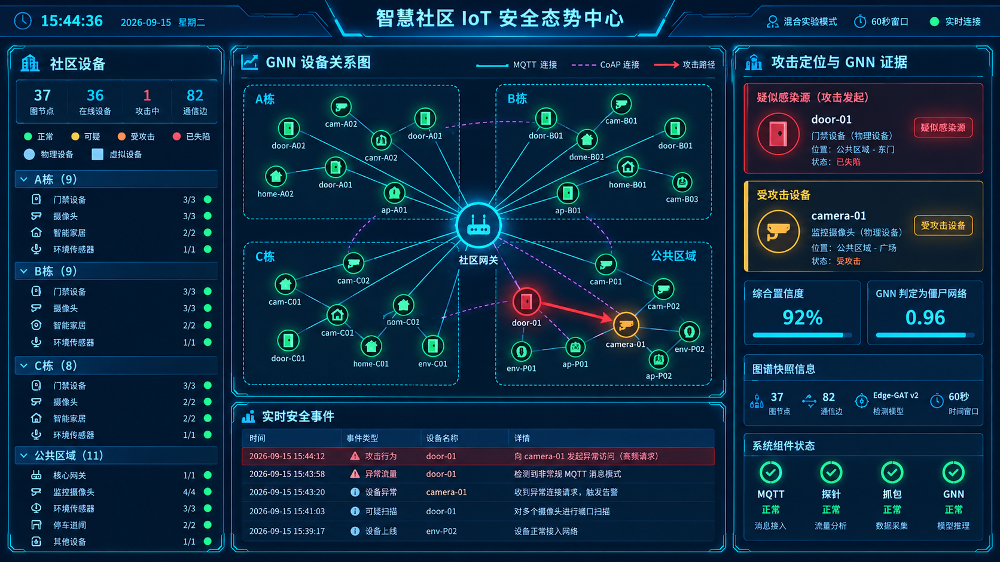
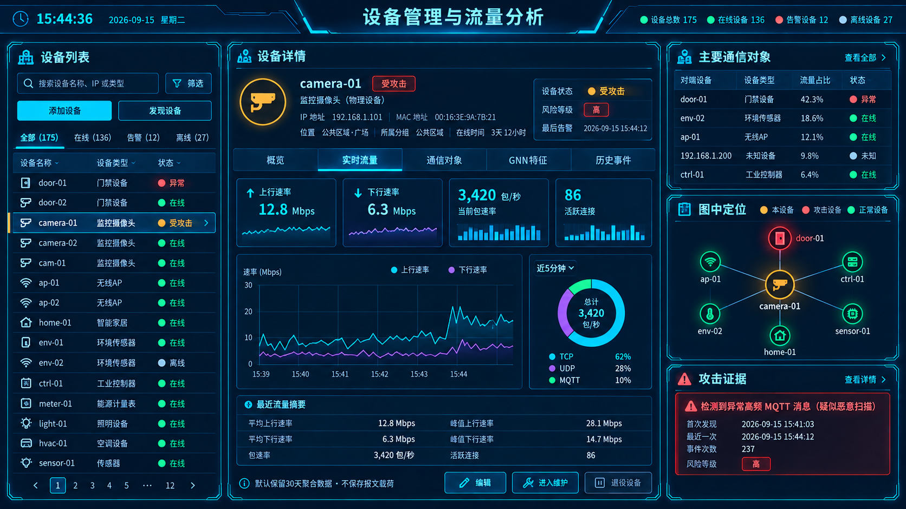
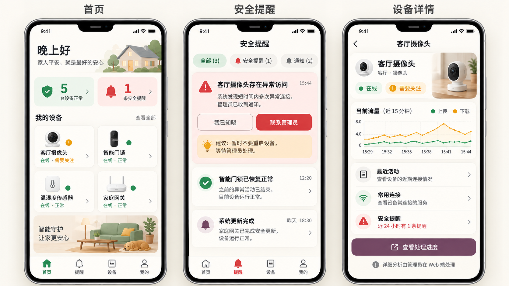

# 11 - 核心重构计划：实时设备状态与攻击设备定位

> 状态：历史重构设计。第 12 节“旧功能取舍”作为本次清理依据；实施事实与当前能力见 [清理清单](rebuild/legacy-cleanup-inventory.md)、[当前 API](05-api-spec.md) 和 `docs/rebuild/` 契约。
> 编写日期：2026-09-15；结合 UI、GNN 仿真与双端分工参考修订于 2026-09-18
> 适用范围：Web 管理员端、APP 用户端、Flask 后端、树莓派探针、ESP32 设备
> 核心目标：打开系统后，用户能立即看见“连接了哪些设备、每台设备是否在线、哪台设备正在遭受攻击或已被感染”。
> 设计参考：大屏 UI 照片、`11-domain-shift-solution.md`、`12-community-simulation.md`（仅作为参考输入，最终约束以本文为准）

---

## 1. 重构结论

本轮不继续扩展“大而全”的安全管理平台，而是把产品收缩为一个可靠的**实时设备安全监视器**。

第一版保留四条主线：

1. **设备连接状态**：显示当前连接设备、在线/延迟/离线状态、最后上报时间。
2. **设备安全状态**：显示安全、可疑、正在遭受攻击、疑似被感染、已隔离等状态。
3. **攻击事件定位**：明确攻击涉及哪台设备、设备在事件中是受害者还是可疑攻击源，并展示必要证据。
4. **双端互补使用**：Web 负责管理员功能、完整 GNN 图、深入流量分析和事件处置；APP 负责普通用户查看本人获授权的设备、接收易懂提醒、查看处理进度和联系管理员。

第一版不追求复杂统计、自动处置或大量图表。Web 与 APP 共用同一后端、同一设备状态和同一事件数据，不分别复制业务判断。

---

## 2. 可验收目标

### 2.1 核心目标

| 目标 | 验收标准 |
|---|---|
| 设备自动出现 | 已登记设备发出首个心跳后，10 秒内出现在监视页 |
| 在线状态实时变化 | 心跳周期建议为 5 秒；连续约 15 秒未上报显示“延迟”，约 30 秒未上报显示“离线” |
| 攻击设备明显可见 | 检测到事件后，对应设备卡片变色并置顶，页面顶部出现攻击横幅 |
| 攻击角色明确 | 至少区分“受攻击设备”“疑似被感染并向外攻击的设备”“外部攻击源”“暂时无法定位” |
| 页面更新及时 | 后端状态产生变化后，前端在 1 秒内收到推送；断线时必须显示“实时连接已中断” |
| 状态可恢复 | 攻击停止后经过连续安全窗口进入“恢复中”，再回到“安全”，不能永久红色，也不能立刻抖回绿色 |
| 重启不丢事件 | 后端重启后，当前设备清单和历史攻击事件仍可查询 |
| 不用假数据掩盖故障 | API 不可用时显示真实错误和最后成功更新时间，不替换成演示设备或演示告警 |
| 双端状态一致 | 同一获授权设备和提醒在 Web、APP 内部引用相同 ID、状态和数据版本；APP 可隐藏技术字段并改写为易懂文案，显示延迟差不超过 5 秒 |
| APP 数据隔离 | user 只能查看令牌授权的设备/区域，不能看到其他用户设备、完整社区图或管理员证据 |
| Web 设备管理 | 管理员可添加、编辑、退役和按条件彻底删除设备，所有操作有校验和记录 |
| 设备流量可查看 | 点击设备后可查看实时上下行速率、包/流速率、协议构成、通信对象、GNN 特征和历史趋势 |

### 2.2 实时性的定义

“实时”拆成两部分，避免把页面推送速度和模型检测窗口混为一谈：

- **连接状态实时性**：5～10 秒级，来自 MQTT 心跳、DHCP/ARP 和最近流量。
- **安全检测实时性**：
  - 快速规则通道：目标 3～5 秒内给出“可疑/正在遭受攻击”的初步状态；
  - 设备 GNN 通道：第一版使用经重建、重训和验证的 60 秒窗口给出“设备风险/疑似感染”的确认结果；如果后续改为 120～300 秒，训练和推理必须同步修改；
  - 后端一旦形成结论，前端推送延迟目标小于 1 秒。

页面必须显示结论来源和时间，例如“规则初判 · 2 秒前”或“设备 GNN 确认 · 置信度 96%”，不把尚未确认的判断包装成确定事实。

---

## 3. 当前项目审计

### 3.1 值得保留的基础

| 现有资产 | 处理建议 | 原因 |
|---|---|---|
| React + Vite + TypeScript Web 前端 | 保留技术栈，重做信息架构 | 已能稳定承载设备卡片、详情和事件列表 |
| Expo/React Native 移动端 | 保留工程基础，重做为普通用户端 | 已有 Dashboard、Assets、Alerts 等页面和共享 API 思路 |
| Flask + SQLite | 第一版保留 | 对 6～100 台本地设备足够，部署成本低 |
| 树莓派抓包/探针链路 | 保留并收敛职责 | 是真实网络数据入口 |
| ESP32 的 `community/{device_id}/status` MQTT 上报 | 保留并规范消息 | 已有稳定设备 ID 和 5 秒级遥测基础 |
| 设备图 GNN 的 ONNX 模型和归一化文件 | 保留为确认通道 | 已具备“设备级风险”能力 |
| 现有规则检测和流量聚合思路 | 保留可验证部分 | 可承担快速预警和攻击方向判断 |
| 训练脚本、模型和历史文档 | 归档保留 | 不进入运行主链路，但不应直接删除 |

### 3.2 必须修正的问题

1. `assets.status` 同时表达在线、离线和告警，连接状态与安全状态互相覆盖。
2. ESP32 已经发布 MQTT 状态，但后端当前没有形成统一的设备心跳消费和离线判定链路。
3. 设备 GNN 当前需要手动调用检测接口；已有的窗口到期判断没有接入自动调度。
4. `device_risk_cache` 只存在进程内存，重启即丢失，也没有形成设备事件历史。
5. 设备风险结果是“IP → 风险”，没有稳定关联到设备 ID；IP 变化时容易认错设备。
6. 现有拓扑图的风险主要由资产表状态推导，并不等价于设备 GNN 的实时结论。
7. 前端主要依赖 10 秒轮询，而且部分组件存在演示兜底数据，后端断开时可能仍显示一张“看起来正常”的图。
8. 告警里的源 IP、目标 IP 与“哪台设备受攻击/哪台设备被感染”没有建立统一语义，容易在界面上标错角色。
9. 现有 Web 与 APP 页面重复较多，但功能边界和状态契约不清晰；若继续复制同样的仪表盘，会增加维护成本并造成双端状态不一致。
10. 训练图默认按 3600 秒窗口构建，而实时检测默认使用 60 秒窗口，节点特征存在约 60 倍时间尺度差异；窗口不对齐时，UI 再精美也不能代表结果可靠。
11. 当前现场只有约 6 台物理设备，通信容易退化成“设备只连网关”的星型图，与设备图 GNN 训练时的社区级规模和关系结构不一致。
12. 当前模型使用二值邻接矩阵，只表达“是否通信”，没有利用协议、流量次数、字节数和持续时间等边特征。
13. 参考方案中提到的虚拟设备生成器目前尚未出现在仓库中，需要作为待实现模块，不应在计划中写成已经完成。

---

## 4. 第一版范围

### 4.1 必须实现

- Web 核心页：实时设备监视；当前事件、最近事件、GNN 图和设备详情在同一工作区完成。
- APP 核心页：首页、安全提醒、本人设备、设备详情和个人/连接设置。
- Web 与 APP 只使用后端 API/SSE/通知数据，不在客户端各自重新计算安全状态。
- 一个精简设置抽屉：采集网卡、设备登记、心跳阈值、检测开关和检测窗口。
- Web 端设备全生命周期管理：添加、编辑、维护、退役、恢复和受控删除。
- 点击设备查看流量：Web 提供完整实时/历史流量分析，APP 提供精简摘要。
- 最小权限体系：admin 管理设备与配置，operator 在 Web 处置事件，user 在 APP 查看获授权设备和用户提醒；APP 不提供管理员操作入口。
- 设备自动上线、延迟、离线判定。
- 设备维护、停用和检测预热状态。
- 已知设备与未知设备发现。
- 6 台物理设备与 30 台虚拟设备组成的显式“混合实验模式”，形成约 37 个图节点；生产模式默认关闭虚拟设备。
- 设备安全状态实时更新。
- 训练窗口与推理窗口严格一致，并保存每次 GNN 推理使用的图快照。
- 设备图显示节点、通信边、关系类型、边权和攻击路径；图中数据必须来自真实构图结果，不使用前端虚构连线。
- 攻击设备高亮、置顶、横幅提醒和详情证据。
- 后端/探针/抓包/模型状态可见。
- 实时推送断线提示、自动重连和完整状态重新同步。
- 事件去重、状态防抖、恢复判定和持久化。
- 攻击演示流量与公网隔离，设备和探针上报入口经过身份校验。

### 4.2 暂缓实现

- 独立事件管理页面；核心验收后再从主页面拆出。
- 复杂大屏 KPI、风险总分、攻击分布饼图、热力图和 MITRE 攻击链。
- 通用策略管理、组织级复杂权限和独立审计中心；admin/operator/user、用户设备可见范围和管理记录仍属于第一版。
- 离线 PCAP 上传分析和 Excel 导出。
- 摄像头实时画面。
- 自动封禁、自动断电等不可逆或高风险处置。
- 多模型同时竞争输出；第一版只保留“快速规则初判 + 设备 GNN 确认”的清晰链路。

### 4.3 明确不做

- 不以 IP 作为设备唯一身份。
- 不把“离线”显示为“高危攻击”。
- 不在真实模式中静默回退到演示数据。
- 不在证据不足时硬说某台设备“已被攻击”。
- 不先做炫酷拓扑，再补真实数据链路。
- 不向公网地址发送任何攻击模拟流量。
- 不把“物理/虚拟”标记直接作为 GNN 分类特征，避免模型学会模拟环境痕迹。
- 不在模型仍使用二值邻接时声称“边特征已经参与推理”；UI 必须展示真实模型版本和输入能力。

---

## 5. 核心状态模型

每台设备需要分别记录连接状态、安全状态、运行模式和检测就绪度；攻击事件再单独记录设备角色。任何一组状态都不能覆盖另一组状态。

### 5.1 连接状态 `connection_status`

| 状态 | 含义 | 默认判定 |
|---|---|---|
| `unknown` | 已登记，但系统还没见过 | 从未收到心跳或流量 |
| `online` | 正常连接 | 最近心跳在 15 秒内 |
| `stale` | 连接延迟或数据不新鲜 | 15～30 秒未收到心跳 |
| `offline` | 已离线 | 超过 30 秒未收到心跳，且近期没有可信流量 |

连接状态的阈值应配置为心跳间隔的倍数，而不是散落在代码里的固定数字。

### 5.2 安全状态 `security_status`

| 状态 | 含义 | 页面表现 |
|---|---|---|
| `unknown` | 检测尚未运行或模型不可用 | 灰色，并写明原因 |
| `safe` | 当前窗口未发现异常 | 绿色 |
| `suspicious` | 快速规则或低置信结果异常 | 黄色 |
| `under_attack` | 该设备是攻击流量目标 | 橙/红色，标“正在遭受攻击” |
| `compromised` | 该设备疑似被感染并产生攻击行为 | 红色，标“疑似被感染” |
| `isolated` | 人工确认并执行隔离 | 紫/灰色，连接状态仍单独显示 |

### 5.3 事件角色 `incident_role`

- `victim`：受攻击的本地设备。
- `compromised_source`：疑似被感染、正在向外或向其他设备发起攻击的本地设备。
- `external_source`：源地址不是已管理设备，显示为外部攻击源。
- `unknown`：当前证据只能确认异常，无法可靠判断角色。

同一事件可关联多台设备和多个角色。例如一台门禁被感染后攻击摄像头：门禁是 `compromised_source`，摄像头是 `victim`。页面不能只显示一个模糊的“攻击设备”。

### 5.4 运行模式 `operation_mode`

| 状态 | 含义 | 告警策略 |
|---|---|---|
| `active` | 正常投入使用 | 正常监控和告警 |
| `maintenance` | 正在升级、调试或计划断电 | 继续记录状态，但设备离线不触发安全告警 |
| `disabled` | 已停用或不再受管 | 不参与在线率和安全统计 |

运行模式只能由用户或明确的运维流程修改，检测引擎不能因为设备离线自动把它改成维护状态。

### 5.5 检测就绪度 `detection_readiness`

| 状态 | 含义 | 页面表现 |
|---|---|---|
| `warming_up` | 后端刚启动、设备刚上线或当前样本不足 | 显示“正在收集数据”和剩余窗口时间 |
| `ready` | 数据量和窗口满足检测要求 | 正常展示安全状态 |
| `degraded` | 抓包、规则、模型或数据源部分不可用 | 显示降级原因，不得显示为全绿安全 |

预热期间可以产生快速规则预警，但不能用不完整窗口直接宣称设备安全。后端重启、采集网卡切换和 GNN 模型重新加载时，都需要重新进入预热状态。

### 5.6 状态防抖与恢复

- 单个异常包不能直接把设备变成红色。
- 快速规则达到阈值时先进入 `suspicious` 或 `under_attack`。
- GNN 高置信确认或多条证据一致时升级为 `compromised`。
- 攻击停止后先进入“恢复中”，连续 3 个安全窗口后再变为 `safe`。
- 离线不会自动清除安全事件；离线且有未结束事件时应同时显示“离线 / 存在未解决攻击”。
- 维护状态不会删除已有攻击事件；退出维护后必须重新预热，再恢复正常判定。

---

## 6. 设备身份与在线判定

### 6.1 身份优先级

推荐使用以下稳定标识顺序：

1. 固件中的 `device_id`，如 `door-01`。
2. 设备 MAC 地址。
3. DHCP 租约中的主机名和 MAC。
4. 当前 IP 仅作为会变化的网络属性。

数据库中的设备主键使用系统生成 ID，并分别保存 `device_id`、MAC 和当前 IP。IP 变化时更新设备属性，不创建一台“新设备”。

### 6.2 在线证据

在线状态按可信度综合以下来源：

- **主来源**：MQTT `community/{device_id}/status` 心跳/遥测。
- **辅来源**：树莓派 DHCP 租约、ARP 邻居表。
- **弱来源**：抓包中最近一次看见该 IP/MAC 的时间。

MQTT 消息建议补充消息版本、序号、固件版本、设备运行时长、IP、MAC 和设备时间。在线判定以**后端接收时间**为准，避免设备时钟不准导致误判。

### 6.3 未知设备

系统发现不在登记表中的 MAC/IP 时：

- 自动显示在“待确认设备”分组；
- 默认名称为“未知设备 + MAC 后四位”；
- 不自动当作安全设备，也不自动加入受控设备；
- 用户确认后再绑定名称、类型和 `device_id`。

这项能力能补齐“我所连接设备”中最容易遗漏的部分，也能把陌生接入本身作为安全信号。

### 6.4 设备档案、区域与重要性

每台受管设备除身份信息外，建议保存：

- 所属区域，如 A 栋入口、物业中心、室外道路；
- 业务重要性：核心、重要、普通；
- 设备负责人或用途；
- 预期心跳周期、常用协议和端口；
- 允许访问的本地设备与外部目标范围；
- 当前固件版本和基线版本。

事件排序不能只看模型严重度，还要结合设备重要性。同样的异常发生在门禁和普通温湿度传感器上，门禁应优先处理。

### 6.5 按设备类型建立正常基线

摄像头、门禁、路灯、插座、传感器和音箱的正常行为差异很大。第一版先采用可解释的静态基线：

- 正常心跳频率和允许波动；
- 正常上下行速率范围；
- 常用协议、端口和通信目标；
- 单窗口正常连接数和目标数；
- 设备启动或固件升级时允许的短时变化。

通用规则和 GNN 结论需要参考设备基线。现场数据积累后，再评估是否升级为自动学习基线，避免一开始引入难以解释的新模型。

正常模拟流量不能只有“所有设备都连树莓派的 MQTT”。实验环境应根据设备类型生成带随机扰动的多协议行为：

| 协议关系 | 用途 | 安全实现要求 |
|---|---|---|
| MQTT | 设备遥测和控制 | 连接本地 Broker，间隔、包大小和持续时间带合理扰动 |
| CoAP/UDP | 同楼栋设备联动 | 只访问本实验网段内的目标设备 |
| DNS | 模拟域名解析 | 使用本地 DNS 仿真服务，不查询公共解析器 |
| NTP | 模拟时间同步 | 使用本地 NTP 仿真服务，不访问公网 NTP |
| HTTP/HTTPS | 模拟云 API 或视频元数据 | 使用本地“云服务”或流量接收器，不访问真实公网站点 |

对齐目标是让 13 维节点特征覆盖合理的正常分布，而不是机械复制某个公开数据集的单一均值。所有频率、目标、端口和包量都需要随机化；训练、验证和测试使用不同随机种子与设备组合。

---

## 7. 目标架构

```text
6 台物理 ESP32 ────────────────┐
独立电脑上的 30 台虚拟设备 ─────┼── Wi-Fi ──> 树莓派 AP/网关/抓包
本地 DNS/NTP/HTTP/CoAP 仿真服务 ┘                    │
                                                     ├─> 设备登记与在线状态
MQTT 心跳 + DHCP/ARP ────────────────────────────────┤
                                                     ├─> 流聚合 + 快速规则
                                                     └─> 60 秒图构建器
                                                            │
                                   图快照（节点、关系、边权、13 维特征）
                                                            │
                                             GNN 推理 + 事件归因
                                                            │
                                      当前状态 / 图快照 / 事件持久化
                                                            │
                                     REST 快照 + SSE 增量事件
                                              ┌─────────────┴─────────────┐
                                              │                           │
                                   Web 管理员端                   APP 用户端
```

### 7.1 推荐部署

- 树莓派运行 MQTT Broker、设备状态采集、抓包、检测和后端 API。
- 6 台物理 ESP32 作为真实设备和实体演示锚点。
- 30 台虚拟设备运行在独立电脑上，作为树莓派热点的真实 Wi-Fi 客户端；不放在树莓派本机，避免流量走回环接口而无法被网关采集。
- 虚拟设备按 A/B/C 三栋楼和公共区域组织，使用独立 IP、独立 device_id、随机化参数和设备间联动。
- Web 前端可由树莓派提供，也可在同一局域网的电脑上访问。
- 第一版仍使用 SQLite，并开启适合并发读取的 WAL 模式。
- 模型训练目录不进入树莓派运行依赖；部署包只带推理必需文件。
- “混合实验模式”必须在 UI 顶部持续显示；生产模式关闭全部虚拟节点和本地攻击发生器。

### 7.2 实时通信选择

第一版推荐 **REST + SSE（Server-Sent Events）**：

- 首次打开页面通过 REST 获取完整快照；
- 后续通过 SSE 接收设备状态和攻击事件变化；
- SSE 断开后自动重连，并使用事件序号或重新拉快照补齐遗漏；
- Web 端长期保持 SSE；APP 前台优先使用 SSE，若移动网络环境不稳定则退化为 5 秒增量轮询；
- APP 切回前台时必须先重新获取快照，不能只依赖休眠前的本地状态；
- 客户端只需要接收服务端推送，SSE 比双向 WebSocket 更简单。

如果后续加入大量双向远程控制，再评估切换 WebSocket。设备本身的控制仍走 MQTT，不与浏览器推送通道混用。

APP 后台无法依靠持续 SSE 保证收件。局域网离线版只保证 APP 前台实时；若需要锁屏和外网环境下的高危通知，应单独增加推送网关，并明确其联网、凭据和隐私边界。

### 7.3 事件类型

至少需要以下实时事件：

- `device.discovered`
- `device.connection_changed`
- `device.telemetry_updated`
- `device.security_changed`
- `graph.snapshot_created`
- `graph.node_state_changed`
- `graph.inference_completed`
- `incident.opened`
- `incident.updated`
- `incident.recovering`
- `incident.resolved`
- `system.component_changed`

每个事件都应包含唯一事件号、服务端时间、设备 ID、状态版本和数据来源，保证断线重连后不会乱序覆盖新状态。

### 7.4 数据入口和演示安全边界

- 每台 ESP32 使用独立 MQTT 身份，只允许发布自己的状态主题、订阅自己的控制主题。
- 树莓派探针上报使用独立令牌，并对时间戳、序号、请求大小和频率做校验。
- 浏览器管理接口与设备上报接口分开；设备凭据不能用于管理操作。
- 管理服务默认只监听可信局域网，跨网访问需要单独启用认证和 HTTPS。
- 当前固件中的公网攻击目标 `8.8.8.8` 必须在任何攻击测试前移除。
- 攻击模拟只允许指向无公网路由的本地靶机或流量接收器，并设置最大包速率、最长持续时间和紧急停止开关。
- 树莓派出口增加实验网段防护规则，确保模拟攻击包不能转发到公网。

这部分属于 P0 前置条件，不以“只是演示”为由延后。

### 7.5 GNN 图结构约束

第一版构图必须与模型训练、推理和 UI 使用同一份图快照：

| 图元素 | 第一版定义 | 后续升级 |
|---|---|---|
| 节点 | 设备、网关、受控的本地服务/外部角色 | 可升级为异构节点类型嵌入 |
| 节点特征 | 当前 13 维流量统计；不包含可记忆身份的 IP 数值 | 增加本地基线偏离量和时序表示 |
| 边 | 当前窗口内真实发生的通信关系 | 从二值边升级为协议类型和有向边 |
| 边特征 | UI 和快照先保存协议、flow_count、bytes、duration | 验证有效后接入 Edge-GAT/HGT 推理 |
| 时间 | 每个快照固定 60 秒，训练与推理完全一致 | 评估 120～300 秒或时序图记忆单元 |
| 标签 | 正常、侦察、拒绝服务、僵尸网络四级节点风险 | 保留事件角色作为独立归因结果 |

物理/虚拟、楼栋、设备名称可以用于 UI 分组和运维，但只有训练数据中存在并经过验证的字段才能进入模型。特别是“物理/虚拟”不能成为分类特征，否则模型可能只学会识别模拟器。

### 7.6 GNN 分阶段升级路线

1. **先修正现有 GAT**：使用 60 秒重新建图、训练、验证和导出 ONNX，确保训练与推理窗口一致。
2. **再验证社区规模**：用 6 台物理设备 + 30 台虚拟设备形成约 37 节点图，检查度分布、孤立节点、星型退化和域偏移。
3. **再做边特征化**：在图快照中先保存协议类型、流数、字节和持续时间，通过离线对比确认提升后再修改模型。
4. **最后评估异构时序模型**：只有 Edge-GAT 明显受限时，再升级 HGT/HTGAT/TGN；这属于模型增强，不阻塞第一版实时监视闭环。

任何模型版本都必须在 UI 中显示实际输入能力。例如当前模型只使用二值邻接，就显示“GAT · 二值边”；升级后才显示“Edge-GAT · 协议与边权”。

### 7.7 Web 与 APP 共享架构

- Flask 后端和 SQLite/GNN 状态是唯一事实来源；Web 与 APP 不各自维护另一套设备状态机。
- 两端共享同一 API 版本、字段定义、风险语义、角色名称和时间格式；允许 Web 与 APP 使用不同视觉主题，但“正常/关注/高危”等含义必须一致。
- 每个设备、事件和图快照分别使用稳定的 `device_id`、`incident_id` 和 `graph_id`，双端可定位到同一对象。
- Web 设备管理与配置需要 admin 权限，事件处置允许 admin/operator；APP 只使用 user 权限，不能添加、编辑、退役或删除设备，也不能改变安全事件结论。
- APP 首次连接通过服务地址 + 一次性配对码或二维码获取短期 user 令牌，令牌绑定可见设备/区域，不在安装包中写死管理员密码。
- 设备管理、事件处置、配置修改、用户提醒已读和联系管理员请求都由后端记录操作者、时间、对象和变更摘要。

---

## 8. 攻击检测与设备定位

### 8.1 两级检测

#### A. 快速通道

基于短时间窗口的确定性规则识别：

- 突发包速率或字节速率；
- 单设备短时间访问大量端口或目标；
- SYN/UDP/ICMP 异常比例；
- MQTT 心跳正常但业务流量突然异常；
- 某设备被大量不同来源集中访问；
- 已登记设备主动连接非常见外部目标。

快速通道负责及时把设备标成“可疑”或“正在遭受攻击”，不直接代替模型确认。

#### B. 设备 GNN 确认通道

- 后台每 60 秒自动冻结一个不可变图快照并推理，不再要求用户手动触发。
- 训练图、验证图和线上图使用完全相同的窗口、13 维特征定义、归一化参数和节点/边语义。
- 保存每个设备的四级风险、置信度、窗口起止时间、graph_id、模型版本和推理耗时。
- GNN 输出表示“设备级风险/疑似感染程度”，不能单独证明它一定是受害者。
- 结合流量方向和快速规则，才能给出 `victim` 或 `compromised_source` 角色。
- 模型不可用、节点数不足、图结构退化或现场特征偏离训练分布时，输出 `degraded`，不能继续沿用上一窗口的绿色结论。

### 8.2 设备归属规则

| 场景 | 应高亮的设备 | 角色 |
|---|---|---|
| 外部 IP 高频访问本地摄像头 | 摄像头 | `victim` |
| 本地门禁向大量外部目标发 UDP 洪水 | 门禁 | `compromised_source` |
| 本地门禁攻击本地摄像头 | 门禁和摄像头 | 门禁为 `compromised_source`，摄像头为 `victim` |
| 模型只发现某节点高风险，方向证据不足 | 该节点 | `unknown`，显示“疑似异常设备” |
| 目标 IP 无法映射到设备 | 不随意高亮设备 | 事件中显示“受影响设备暂未识别” |

### 8.3 事件证据

设备详情至少显示：

- 攻击类型或异常类别；
- 首次发现、最近发生和持续时间；
- 源设备/源 IP、目标设备/目标 IP；
- 协议、端口、包速率、字节速率、目标数量等关键统计；
- 检测来源（规则、GNN 或两者一致）；
- 置信度和模型版本；
- 当前事件阶段与处置状态。

原始报文默认不直接塞进主页面，需要时再保留受控、脱敏的证据摘要。

### 8.4 事件聚合

系统不按异常包生成告警，而是用“异常类别 + 源设备 + 目标设备 + 流量方向”形成事件指纹：

- 同一指纹在合并窗口内只保留一个活动事件；
- 后续异常追加到该事件，更新最近发生时间、累计次数、峰值和最新证据；
- 证据增强时允许事件从可疑升级为确认，不创建重复事件；
- 事件进入恢复或解决后，再次出现时按可配置的重开窗口决定恢复旧事件或创建新事件；
- 多目标攻击可以有一个父事件，并关联多个受影响设备，避免告警风暴。

### 8.5 综合可信度

页面上的“事件可信度”不能直接等同于某个模型的输出概率。建议综合以下证据：

- 快速规则是否命中以及命中强度；
- GNN 是否确认及其概率；
- 流量方向是否能稳定判断设备角色；
- device_id、MAC 与 IP 的身份映射是否可靠；
- 数据是否新鲜、窗口样本是否充分；
- 是否偏离该设备类型的正常基线。

页面可以同时显示“事件可信度：高”和“GNN 置信度：96%”，让用户区分系统综合判断与单一模型结果。

### 8.6 影子检测与回放

- 初次接入真实设备或调整规则、模型时，先运行影子模式：记录判断和证据，但不改变设备主状态，也不发送高危通知。
- 使用正常心跳、断电、外部攻击、本地设备被感染、本地设备互相攻击五类固定样本进行回放。
- 影子结果达到约定的误报、漏报和定位指标后，再切换为正式检测。
- 每次调整基线、规则、窗口或模型后重复回放，防止修复一个场景却破坏另一个场景。

### 8.7 图质量与域偏移监控

每个 GNN 快照在推理前记录并检查：

- 节点数、边数、平均度、孤立节点数和最大连通分量；
- 物理设备、虚拟设备、网关和本地服务节点数量；
- 13 维特征的缺失率、极值和相对训练分布的偏离程度；
- 当前图是否退化为单一星型；
- 训练窗口、推理窗口、归一化文件和模型版本是否匹配；
- 边关系中 MQTT、CoAP、DNS、NTP、HTTP 和其他协议的比例。

当图节点少于配置下限、孤立节点过多或特征偏移超过阈值时，界面显示“图质量不足/存在域偏移”，GNN 结果降级为辅助证据。第一版不要求一个复杂的“域偏移总分”，但必须明确显示触发降级的具体原因。

---

## 9. 数据设计

建议重建一套简洁的 v3 数据结构，不继续让旧表承担互相冲突的语义。

| 数据实体 | 用途 | 关键内容 |
|---|---|---|
| `devices` | 稳定设备档案 | 系统 ID、device_id、MAC、名称、类型、当前 IP、区域、重要性、运行模式、生命周期状态、基线版本 |
| `device_states` | 每台设备最新状态 | 连接状态、安全状态、检测就绪度、最后心跳/流量时间、当前风险、版本号 |
| `device_observations` | 状态来源记录 | MQTT、DHCP、ARP、流量、接收时间；可按策略采样保存 |
| `traffic_aggregates` | 设备流量趋势 | device_id、时间桶、上下行字节/包/流、协议与目标统计；不默认保存载荷 |
| `graph_snapshots` | 每次 GNN 推理使用的不可变图 | graph_id、窗口、节点/边数、图质量、特征版本、模型版本、推理状态 |
| `graph_nodes` | 快照中的节点状态 | graph_id、device_id、13 维原始特征、归一化特征摘要、预测类别和概率 |
| `graph_edges` | 快照中的通信关系 | graph_id、源/目标节点、方向、协议类型、flow_count、bytes、duration |
| `model_runs` | 推理运行记录 | graph_id、模型/归一化版本、输入能力、耗时、错误和降级原因 |
| `incidents` | 一次完整攻击事件 | 事件指纹、类型、严重度、综合可信度、阶段、首次/最近时间、确认/恢复/解决状态 |
| `incident_devices` | 事件与设备关系 | 设备 ID、事件角色、置信度 |
| `incident_evidence` | 可解释证据 | 规则命中、模型输出、流量统计、检测版本 |
| `system_components` | 系统健康 | MQTT、探针、抓包、规则引擎、GNN、数据库的当前状态 |
| `users_and_sessions` | 双端最小权限 | admin/operator/user、短期令牌、APP 配对信息、可见设备范围和失效时间 |
| `management_actions` | 管理操作记录 | 添加、编辑、维护、退役、恢复、删除、事件确认及操作者 |

数据策略：

- 当前状态与事件历史分开；不能只覆盖一行状态而失去变化过程。
- 心跳不必永久逐条保存，可按分钟聚合或只保留最近 24 小时明细。
- 实时流量使用内存中的 1～2 秒统计推送；历史趋势按 1 分钟聚合保存，默认保留 7～30 天。
- 默认不保存完整报文载荷；设备流量页展示元数据和聚合指标，必要证据另行受控保存。
- 图快照默认保留最近 24 小时完整节点/边数据，之后只保留事件关联快照和汇总指标，避免 SQLite 快速膨胀。
- 攻击事件和关键证据默认保留 30 天，阈值可配置。
- 旧 `ids.db` 在迁移前备份；只迁移设备档案和仍有价值的历史告警，不直接覆盖原库。

### 9.1 设备添加、退役与删除语义

设备管理必须区分以下动作：

| 动作 | 含义 | 对历史数据的影响 |
|---|---|---|
| 添加 | 绑定 device_id、MAC、名称、类型、区域、重要性和设备凭据 | 创建新设备档案 |
| 编辑 | 修改名称、区域、重要性、基线等非身份字段 | 保留全部历史 |
| 维护 | 临时停止离线告警，仍采集和记录数据 | 保留全部历史 |
| 退役 | 设备不再参与当前图和在线统计，凭据被吊销 | 历史事件和 graph_id 仍可回看 |
| 恢复 | 将已退役设备重新纳管并重新配对 | 恢复原 device_id 的连续历史 |
| 彻底删除 | 仅用于误添加且没有事件/图引用的设备 | 删除前必须通过引用检查和二次确认 |

Web 页面上的主要操作应叫“退役设备”，而不是把“删除”作为默认按钮。若设备已有告警、图快照或流量历史，只允许退役；管理员确实需要彻底删除时，后端先显示影响范围并要求输入设备名称确认。APP 不提供退役和删除入口。

---

## 10. UI 页面方案

### 10.1 从参考大屏提取的设计语言

以下设计语言只用于 **Web 管理员端**。参考照片适合保留的部分：

- 16:9 横向大屏、中央标题、左上角时钟与日期；
- 深蓝黑底色、青色结构线和分区明确的三栏布局；
- 中央区域承担最重要的实时内容，两侧放清单和详情；
- 数字、状态和列表能够远距离浏览。

不直接照搬的部分：

- 不使用营业执照、人物照片和活动相册等与安全监控无关的内容；
- 不让所有边框持续高亮，青色只用于结构、选中态和实时连接，红/橙/黄仅用于风险；
- 不使用没有决策价值的环形图或装饰性 KPI；
- 不把 30 多台设备全部做成等大的卡片墙，中央必须以 GNN 关系图为主要视觉对象。

建议颜色语义保持唯一：绿色=安全/在线，黄色=可疑，橙色=受攻击，红色=疑似感染或确认高危，紫色=已隔离，灰色=未知/离线/不可用。颜色必须同时配合文字、形状或线型，不能只靠颜色区分。

APP 用户端不沿用 Web 的深蓝黑和青色科技风。APP 使用暖白/米白背景、暖灰卡片和深灰正文，绿色表示正常，琥珀色表示需要关注，珊瑚红只用于真实高危提醒，可少量使用低饱和梅紫作为辅助色。整体采用圆角卡片、充足留白、大字号和生活化设备名称，避免霓虹光效、密集表格和技术术语。

### 10.2 实时监视页 `/monitor` 的大屏布局

第一版采用一页三栏，而不是恢复多页面驾驶舱：

```text
┌───────────────────────────────────────────────────────────────┐
│ 时间/日期            智慧社区 IoT 安全态势中心     模式/窗口/实时 │
├──────────────┬──────────────────────────────┬─────────────────┤
│ 社区设备      │ GNN 设备关系图               │ 攻击定位与证据   │
│ A/B/C栋/公共区│ 节点、边、边权、攻击路径       │ 源/目标/角色      │
│ 在线/离线/风险│                              │ GNN/规则/可信度   │
│              ├──────────────────────────────┤ 图质量/系统健康   │
│              │ 实时事件时间线                │                 │
└──────────────┴──────────────────────────────┴─────────────────┘
```

- 顶栏高度建议 64～72 px：左侧时钟日期，中间系统标题，右侧显示真实/混合实验模式、图窗口和实时连接状态。
- 左栏约 22%：按 A/B/C 三栋楼和公共区域分组的设备清单。
- 中栏约 54%：GNN 图为绝对主视觉，下方是最近事件时间线。
- 右栏约 24%：当前攻击、设备角色、综合可信度、模型上下文和系统组件状态。
- 1920×1080 是主设计基准；1366 px 宽度下缩小间距但保留三栏；更窄屏幕改为“图 → 攻击详情 → 设备清单”的纵向顺序。

### 10.3 左栏：社区设备与区域状态

左栏不展示冗长资产表，而是先按物理区域汇总，再展开异常设备：

- 顶部只显示图节点数、在线数、攻击中设备数和边数；
- A/B/C 栋和公共区域分别显示在线比例、节点数和联动边数；
- 区域内只直接列出物理设备、异常设备和选中设备，其他虚拟设备合并显示；
- 物理节点使用实心标记，虚拟节点使用空心标记，网关使用方形，外部/本地仿真服务使用菱形；
- 同时显示连接状态、安全状态、运行模式和检测就绪度，不能用一个“状态”标签混合表达；
- 排序规则为：确认高危 > 受攻击 > 疑似感染 > 可疑 > 检测降级 > 离线 > 安全。

### 10.4 中栏：适合 GNN 的设备关系图

图不是装饰性拓扑，必须直接对应某个 `graph_id` 快照。

#### 节点编码

- 节点位置按楼栋和公共区域稳定分区，网关位于中心；禁止每次 SSE 更新都重新启动力导向布局造成节点跳动。
- 节点形状表达角色：设备=圆形、网关=方形、本地服务/外部角色=菱形。
- 实心/空心表达物理/虚拟来源，但该标记只用于 UI，不进入模型特征。
- 外环表达连接状态，内部填充表达安全状态，旁边短标签表达事件角色。
- 默认只标注物理、异常和选中节点名称；缩放或悬停后再显示普通虚拟节点，避免 37 个标签互相覆盖。

#### 边编码

- MQTT、CoAP、DNS/NTP、HTTP 和其他关系使用稳定的线型或小型直接标签；
- 线宽表达窗口内通信权重，方向箭头表达流向；
- 攻击路径使用红色加粗箭头，同时保留源节点与受害节点的角色文字；
- UI 可以显示边特征，即使当前 GAT 仍只使用二值邻接，但必须在模型信息中如实注明“当前模型未使用边特征”。

#### 图操作

- 时间窗口选择：当前 60 秒、上一窗口和事件快照；
- 区域筛选：全部、A/B/C 栋、公共区域；
- 关系筛选：MQTT、CoAP、DNS/NTP、HTTP、攻击路径；
- 显示边权、仅看异常邻居、跟随活动攻击；
- 点击节点打开设备详情，点击边显示协议、flow_count、bytes、duration 和最近通信时间；
- 不在第一版加入任意拖拽编辑拓扑，避免界面位置与真实图结构混淆。

### 10.5 右栏：攻击定位、模型证据和系统健康

没有攻击时显示“当前未发现活动攻击”和最近一次成功推理信息。有攻击时优先显示：

- 可读结论，例如“door-01 疑似被感染，正在攻击 camera-01”；
- 源设备、受害设备和 `compromised_source`/`victim` 角色；
- 首次发现、持续时间、最新证据和事件阶段；
- 综合事件可信度与单独的 GNN 分类概率；
- graph_id、窗口、节点/边数、模型版本、模型输入能力和推理耗时；
- 关键原始特征及相对设备基线的偏离，如目标 IP 数、包速率和异常邻居占比；
- 图质量、域偏移和 MQTT/探针/抓包/GNN 组件健康。

“模型解释”第一版只展示可验证的特征偏离、邻居关系和规则证据。只有模型确实导出并验证注意力权重后，才能展示“高影响邻居/边”；不能把普通边权或前端计算结果冒充 GNN 注意力解释。

### 10.6 设备详情抽屉

点击节点或设备清单后显示：

- 当前连接、安全、运行模式和检测就绪度；
- 设备身份、MAC、IP、区域、重要性和固件版本；
- 当前图窗口的 13 维原始特征，以及相对本设备基线的偏离；
- 一阶通信邻居、关系类型、方向和边权；
- 最近 15～30 分钟状态变化；
- 当前攻击证据、最近事件和关联 graph_id；
- 后端各数据源的最后更新时间。

设备详情中的“流量”标签页必须包括：

- 当前上行/下行速率、每秒包数、每秒流数和活动连接数；
- 最近 5 分钟、15 分钟、1 小时和 24 小时趋势；
- TCP/UDP/ICMP/MQTT/CoAP/DNS/NTP/HTTP 等协议构成；
- 主要通信设备/目标、方向、端口、flow_count、bytes、duration 和最后通信时间；
- 当前 GNN 窗口的 13 维节点特征及相对基线偏离；
- 一键定位到 GNN 图中的该节点，并高亮其一阶邻居和通信边；
- 数据新鲜度、采集来源和是否存在采样/丢包。

流量页默认展示聚合数据，不展示明文载荷。Web 更新频率建议 1～2 秒，APP 摘要建议 5 秒，避免移动端持续绘图耗电。

### 10.7 Web 设备管理

Web 增加“设备管理”入口，支持两种添加方式：

1. **从待确认设备添加**：选择系统发现的 MAC/IP，填写名称、类型、区域和重要性，绑定 device_id 并下发/分配凭据。
2. **手动添加**：填写 device_id、MAC、名称、类型、区域、重要性和预期心跳；保存前检查 device_id/MAC 是否重复。

添加完成后进入“等待首次心跳 → 预热 → 已就绪”流程，不能刚保存就显示在线安全。编辑身份字段时必须重新校验绑定关系。

设备列表提供编辑、进入维护、退役和恢复。彻底删除隐藏在退役设备详情中，仅 admin 可见，并遵守 9.1 节的引用检查和二次确认规则。

### 10.8 最近事件与事件页

主页面中栏底部只保留 3～5 条实时事件：上线、离线、进入可疑、GNN 升级、攻击确认、恢复中和事件解决。独立事件页 `/incidents` 在阶段 5 完成，不阻塞 Web 与 APP 的实时闭环：

- 活动、恢复中、已解决三个分组；
- 按设备、角色、严重度、类型、区域和时间筛选；
- 可回看事件发生时的图快照，而不是用当前拓扑覆盖历史；
- 支持确认、标记误报、解决；
- 第一版仅做人工“隔离建议”，实际隔离动作放到下一阶段。

### 10.9 精简设置抽屉

- 采集网卡与抓包状态；
- MQTT Broker 地址与连接状态；
- 设备登记、重命名和 MAC 绑定；
- 设备区域、重要性、维护状态和行为基线；
- 心跳、延迟、离线阈值；
- 快速规则和 GNN 开关；
- GNN 窗口、模型/归一化版本和最低置信度；
- 虚拟设备生成器、楼栋数量、随机种子和混合实验模式；
- 数据保留时间；
- 真实模式/混合实验/演示回放三种模式。非真实模式必须有持续可见的标识，数据不能静默混入生产统计。

### 10.10 UI 模拟图

以下模拟图只用于确认信息架构、视觉层级和双端分工。图中的数量、事件号和置信度均为布局示例，最终页面必须使用实时数据。

#### 10.10.1 Web 实时态势总览

模拟“门禁被感染并攻击摄像头”的状态，突出完整 GNN 关系图、受害设备、疑似感染源和系统健康。



#### 10.10.2 Web 设备管理与流量分析

模拟管理员选中 `camera-01` 后查看实时上下行流量、协议构成、主要通信对象、局部 GNN 邻居和攻击证据。左侧提供“添加设备”和“发现设备”，默认危险操作为“退役设备”，不把彻底删除设计成醒目的常用按钮。



#### 10.10.3 APP 用户端首页、安全提醒与设备详情

模拟普通用户使用的首页、安全提醒和设备详情。界面改为暖白、深灰、绿色、琥珀色和少量珊瑚红；用户可查看本人设备、简化流量、提醒原因、管理员处理进度，并可标记已知晓或联系管理员。APP 不展示完整 GNN 图、攻击者 IP、模型参数等管理员信息，也不提供添加、编辑、退役、删除设备或修改配置的入口。



### 10.11 可读性与性能要求

- 大屏正文不小于 14 px，关键状态不小于 18 px；不使用低对比度细字堆叠。
- 红、橙、黄、绿必须同时配合角色文字、图标或线型，照顾色觉差异。
- 37 节点图优先使用 SVG/D3；SSE 到达时只更新变化节点和边，不整图重建。
- 正常态不循环播放高亮动画；活动攻击可以使用低频呼吸提示，并尊重“减少动态效果”设置。
- 图首次加载、断线重连和切换历史快照时显示明确的数据时间，不能把旧图伪装成实时图。
- 任何列表和图节点都支持键盘聚焦；重要结论不依赖悬停才能看到。

### 10.12 APP 页面与功能边界

APP 不复制 Web 管理台，而是围绕“普通用户能快速看懂自家/本人设备是否正常，以及管理员是否正在处理”设计：

- **首页**：问候语、获授权设备总数、正常/需要关注数量、最近提醒和常用设备卡片；
- **安全提醒**：使用生活化说明解释发生了什么、影响哪台设备、发现时间和当前处理状态，不直接暴露攻击者 IP、GNN 分数或内部证据；
- **本人设备**：只显示账号获授权的设备/区域，支持搜索、异常筛选和常用设备收藏，不能查看其他住户或无权限区域；
- **设备详情**：显示连接/安全状态、最近活动、当前上下行、5～15 分钟流量小趋势、常用连接和管理员处理进度；
- **用户操作**：可以“我已知晓”、查看安全建议、查看处理进度和联系管理员；误报、解决、隔离和修改状态由 Web 端管理员/operator 完成；
- **个人与连接**：配对状态、授权设备、通知偏好、令牌失效时间和最后同步时间。

APP 不承担：添加/编辑/退役/删除设备、修改 GNN 或规则参数、管理 MQTT 凭据、控制虚拟设备生成器、查看完整社区拓扑、查看其他用户设备或执行事件处置。这些属于 Web 管理员端。

### 10.13 Web 与 APP 互补矩阵

| 功能 | Web 管理员端 | APP 用户端 |
|---|---|---|
| 实时设备状态 | 全部区域、完整清单与 GNN 图 | 仅获授权设备、生活化状态和常用设备 |
| 攻击事件 | 完整证据、graph_id、历史回放、确认/误报/解决 | 易懂提醒、是否已通知管理员、个人已知晓和处理进度 |
| 设备流量 | 1～2 秒实时指标、长时间趋势、协议/邻居/边分析 | 当前上下行、短趋势和常用连接，不展示原始 IP/端口/GNN 特征 |
| 设备添加/编辑 | admin 完整支持 | 不提供 |
| 设备退役/删除 | admin 支持，带影响检查 | 不提供 |
| GNN/规则配置 | admin 支持 | 不展示技术配置，只显示“系统检测正常/异常” |
| 虚拟社区控制 | admin 支持实验模式启停与状态检查 | 不提供 |
| 告警通知 | 页面实时横幅 | 前台实时；后台推送作为联网增强 |
| 事件处置 | admin/operator 支持确认、误报、解决和隔离建议 | 只能“我已知晓”、联系管理员和查看处理进度 |
| 系统维护 | 完整设置与诊断 | 不提供；仅提示“服务暂不可用”及最后同步时间 |

---

## 11. 接口边界

第一版建议收敛为以下面向页面的接口，不继续暴露大量互相重叠的统计接口：

| 接口 | 用途 |
|---|---|
| `GET /api/v3/monitor` | 一次返回系统状态、设备当前状态和活动事件的完整快照 |
| `GET /api/v3/events` | SSE 实时事件流 |
| `GET /api/v3/devices` | 设备列表与筛选 |
| `GET /api/v3/devices/{id}` | 设备详情、最近状态和证据 |
| `GET /api/v3/devices/discovered` | 待确认的未知设备列表 |
| `POST /api/v3/devices` | admin 添加设备或认领待确认设备 |
| `PATCH /api/v3/devices/{id}` | admin 修改名称、区域、重要性、维护状态和基线 |
| `POST /api/v3/devices/{id}/retire` | admin 退役设备并吊销设备凭据，保留历史引用 |
| `POST /api/v3/devices/{id}/restore` | admin 恢复退役设备并重新进入配对/预热流程 |
| `DELETE /api/v3/devices/{id}` | 仅删除无历史引用的误添加设备，要求影响检查和二次确认 |
| `GET /api/v3/devices/{id}/traffic` | 按时间范围返回设备流量聚合、协议和速率趋势 |
| `GET /api/v3/devices/{id}/peers` | 返回设备通信对象、图邻居、方向与边权 |
| `GET /api/v3/graph/current` | 当前 GNN 图快照，包括节点、边、关系类型、边权、图质量和模型能力 |
| `GET /api/v3/graph/snapshots/{graph_id}` | 回看某次推理真正使用的不可变图快照 |
| `GET /api/v3/graph/snapshots/{graph_id}/nodes/{device_id}` | 查询节点 13 维特征、预测和邻居证据 |
| `GET /api/v3/incidents` | 事件历史与筛选 |
| `GET /api/v3/incidents/{id}` | 单次事件详情 |
| `POST /api/v3/incidents/{id}/ack` | 人工确认已看到 |
| `POST /api/v3/incidents/{id}/resolve` | 人工解决事件 |
| `POST /api/v3/incidents/{id}/false-positive` | 标记误报并保留反馈 |
| `GET /api/v3/system` | MQTT、探针、抓包、模型和数据库健康状态 |
| `GET /api/v3/lab/status` | 仅实验模式使用，返回虚拟设备生成器、隔离出口、本地服务和随机种子状态 |
| `POST /api/v3/pairing/start` | admin 在 Web 生成短期 APP 配对码/二维码 |
| `POST /api/v3/pairing/claim` | APP 使用一次性配对码换取绑定设备可见范围的 user 令牌 |
| `GET /api/v3/mobile/overview` | APP 轻量总览，只返回当前 user 获授权的设备和提醒，字段仍引用同一设备/事件 ID |
| `POST /api/v3/mobile/notices/{id}/read` | 用户标记提醒已知晓，不改变安全事件的确认/解决状态 |
| `POST /api/v3/mobile/help-requests` | 用户就指定设备/提醒联系管理员并查看后续处理进度 |

设备遥测从 MQTT 内部消费，不要求 ESP32 直接调用 Web API。树莓派探针的远程上报接口作为内部入口，与浏览器接口分开管理。`/monitor` 可以内嵌当前图摘要，但节点详情和历史回放必须通过 graph_id 查询，避免返回体无限增大。

流量接口只返回元数据和聚合结果。查询参数至少包括 `range`、`bucket`、`direction` 和 `protocol`；后端限制最大时间范围与返回点数，避免 APP 或 Web 一次读取大量原始流量记录。

---

## 12. 旧功能取舍

| 旧模块 | 决策 | 第一版处理 |
|---|---|---|
| Dashboard 态势大屏 | 重做 | 替换为实时监视页 |
| Assets 资产监控 | 重做 | Web 改为设备管理和流量详情；APP 改为轻量设备列表与摘要 |
| Alerts 告警中心 | 简化 | 改成面向设备的事件页 |
| Traffic 流量分析 | 重做并合并 | 不保留孤立的旧流量页；合入设备详情，展示实时/历史聚合、协议、通信对象和 GNN 特征 |
| Analysis/Topology | 重做并合并 | 删除静态兜底拓扑；改成主页面中央的 graph_id 驱动 GNN 关系图 |
| Heatmap/MITRE | 暂缓 | 与当前核心目标关系弱 |
| Policy/Blocklist | 暂缓 | 第一版不自动处置 |
| Login/多角色 | 精简保留 | 只实现 admin/operator/user、用户设备可见范围和 APP 配对令牌，不恢复复杂组织权限 |
| Audit Logs | 精简保留 | 不做独立中心，但必须记录设备管理和事件操作 |
| PCAP 上传 | 暂缓 | 不进入实时监视主线 |
| Excel 导出 | 暂缓 | 需要项目报告时再补 |
| 原生移动 APP | 重做并保留 | 作为普通用户端，不复制 Web 大屏、GNN 技术界面和管理功能 |
| Demo/Fallback 数据 | 删除静默兜底 | 只允许显式“演示回放”；混合实验模式的数据来自真实运行的虚拟设备生成器，并持续标记来源 |
| 摄像头直播 | 暂缓 | 设备状态可靠后作为增强功能 |

旧代码在新链路验收前先归档或隐藏，不直接大规模删除，以便复用模型、固件和检测逻辑。

---

## 13. 实施阶段

### 阶段 0：范围冻结、图契约与实验安全（1～1.5 人日）

任务：

- 冻结 Web 管理员端与 APP 普通用户端的功能边界；混合实验模式采用 6 台物理设备 + 30 台虚拟设备 + 1 个网关节点。
- 记录真实部署网段、树莓派采集网卡、MQTT Broker 和设备清单。
- 为旧数据库和当前可运行版本做可恢复备份。
- 固定设备状态、攻击角色、事件阶段和实时接口契约。
- 固定 graph_id、60 秒窗口、13 维节点特征、边关系、图质量和模型版本契约。
- 审计训练图 3600 秒与推理图 60 秒的不一致，确认重新建图和重训范围。
- 准备五类可重复测试：正常心跳、设备断电、外部攻击设备、被感染设备向外攻击、本地设备互相攻击。
- 建立完全隔离的攻击实验环境，把固件中的公网目标替换为本地流量接收器，并验证实验流量无法离开测试网段。
- 确定 MQTT ACL、设备凭据和树莓派探针令牌方案。

完成标准：状态与图契约含义唯一，测试设备与攻击剧本确定；攻击流量无法到达公网，未经认证的探针不能上报数据。

### 阶段 1：设备在线与社区仿真闭环（3～4 人日）

任务：

- 建立新的设备档案和当前状态数据结构。
- 消费 ESP32 MQTT 状态主题。
- 绑定 device_id、MAC 与当前 IP。
- 实现 online/stale/offline 自动判定。
- 实现 active/maintenance/disabled 运行模式和 warming_up/ready/degraded 检测就绪度。
- 接入 DHCP/ARP/流量作为辅助证据。
- 完成未知设备发现。
- 保存区域、重要性和每类设备的静态行为基线。
- 接入 MQTT 身份与主题权限校验。
- 在独立电脑实现 30 台虚拟设备生成器，按 A/B/C 栋和公共区域分配独立 device_id 与 IP。
- 实现 MQTT 遥测、CoAP 设备联动和本地 DNS/NTP/HTTP 仿真，所有参数带受控随机扰动。
- 确认虚拟设备流量真实经过树莓派采集网卡，而不是电脑或树莓派本机回环。
- 将物理、虚拟和网关来源保存在设备档案中，但不作为模型分类特征。

完成标准：约 37 个图节点稳定出现；设备上电、拔电、重连、维护和 IP 变化都能得到正确且不抖动的状态；冷启动期间明确显示预热而不是安全。

### 阶段 2：图构建、GNN 对齐与攻击定位（4～6 人日）

任务：

- 把快速规则输出统一成设备安全事件。
- 使用 60 秒窗口重新构建训练/验证图、训练模型、校验归一化并重新导出 ONNX。
- 将设备 GNN 改为后台每 60 秒自动冻结图快照并执行。
- 保存 graph_snapshots、graph_nodes、graph_edges 和 model_runs。
- 检查节点数、边数、平均度、孤立节点、最大连通分量和特征域偏移；图质量不足时自动降级。
- 把 GNN IP 结果映射到稳定设备 ID。
- 建立受害者、疑似感染源、外部源和未知四类角色。
- 实现事件合并、升级、恢复和持久化。
- 建立事件指纹，支持多目标父事件和证据持续追加。
- 结合规则、GNN、流量方向、身份可靠性、数据新鲜度和设备基线计算综合可信度。
- 保存最小可解释证据和检测来源。
- 先以影子模式运行，再通过固定样本回放决定是否正式启用状态变更。
- 先验证二值边 GAT 的对齐效果；同时保存协议与边权，为后续 Edge-GAT 离线对比准备数据。

完成标准：训练与推理窗口一致，约 37 节点图不再退化为纯星型；五类攻击测试不会标错设备；无法定位时明确显示未知；同一攻击不会造成告警风暴。

### 阶段 3：Web 管理分析端（4～6 人日）

任务：

- 建立完整快照接口和 SSE 事件流。
- 在单一主页面实现顶栏、区域设备清单、GNN 关系图、攻击证据、详情抽屉、最近事件和设置抽屉。
- 实现待确认设备认领、手动添加、编辑、维护、退役、恢复和受控删除流程。
- 实现设备流量详情：实时速率、历史趋势、协议构成、通信对象、图邻居和 13 维 GNN 特征。
- 图使用稳定楼栋分区布局，显示节点来源、角色、关系类型、边权和攻击路径。
- 支持当前/上一窗口/事件 graph_id 回看，确保历史事件对应历史图。
- 显示模型实际输入能力、图质量与域偏移降级原因，不把 UI 边特征冒充模型输入。
- 实现异常置顶、只看异常、断线提示和自动重连。
- 删除真实模式中的假数据兜底。
- 做响应式布局，保证普通电脑浏览器仍能使用；大屏模式以 1920×1080 为主。

完成标准：攻击发生后无需手动刷新，目标设备立即变化；管理员能安全完成设备全生命周期操作；点击任意设备能看到与抓包/GNN 一致的流量信息。

### 阶段 4：APP 普通用户端（3～5 人日）

任务：

- 基于现有 Expo/React Native 工程重做首页、安全提醒、本人设备、设备详情和个人/连接设置。
- 实现一次性配对码/二维码、user 令牌、设备可见范围和失效处理。
- APP 前台接收 SSE；不稳定时退化为增量轮询；回到前台强制重新同步快照。
- 实现本人设备状态、易懂安全提醒、短时流量趋势、常用连接和管理员处理进度。
- 用户支持“我已知晓”和联系管理员；不能确认/解决安全事件，也不提供添加、编辑、退役、删除或 GNN 参数修改。
- Web 与 APP 统一风险语义、设备/事件 ID 和时间格式，但分别使用管理员深色主题与用户暖色浅色主题。

完成标准：Web 与 APP 查看同一获授权设备和提醒时状态一致；APP 断网、休眠、令牌失效和重新配对都有明确提示；APP 无法查看未授权设备，也不具备事件处置或设备管理能力。

### 阶段 5：事件管理与可靠性（2～3 人日）

任务：

- 完成事件页、确认、误报、解决和恢复流程。
- 验证后端重启、MQTT 重连、探针掉线和浏览器重连。
- 验证 APP 休眠恢复、网络切换、增量轮询回退、令牌吊销和双端同步。
- 增加数据库保留与清理策略。
- 加入状态转换、设备归属、事件合并和断线重连测试。
- 建立固定流量回放回归测试，覆盖正常、断线、外部攻击、感染源和设备互攻。
- 使用不同随机种子、设备组合和攻击目标做训练/验证/测试分离，避免模型记住生成器。
- 验证未经认证、乱序、重复和超大遥测消息不会污染当前状态。
- 验证 CPU、内存、数据库增长和长时间运行。

完成标准：连续运行 8 小时状态稳定；重启后不丢当前设备和历史事件。

### 阶段 6：可选增强（核心验收后再排期）

- 手动隔离与解除隔离，所有动作要求二次确认。
- Edge-GAT 边特征化离线对比；确认提升后再替换当前二值边模型。
- HGT/HTGAT/TGN 异构时序模型研究，不阻塞第一版交付。
- 摄像头画面与被攻击叠加效果。
- 外网或锁屏后台推送网关、桌面通知和可静音声音提醒。
- 自动学习行为基线和固件版本异常提醒。
- 报表导出和长期趋势。

如果只重做实时状态与现有检测接入，预计仍为 **9～14 人日**。完成“GNN 适配的混合社区 Web 版”预计 **14～22 人日**；再完成互补 APP、配对权限、设备管理和双端同步后，整体预计 **17～26 人日**。以上不含硬件故障排查、外网推送服务和需要多轮试验的模型域偏移校准。

---

## 14. 测试与验收清单

### 14.1 设备连接

- [ ] 6 台设备逐台上电，名称、类型、device_id、MAC、IP 正确。
- [ ] 心跳正常时稳定显示在线，无频繁闪烁。
- [ ] 单台设备断电后先延迟、再离线，其他设备不受影响。
- [ ] 设备重新上线后恢复为在线，仍是同一台设备。
- [ ] DHCP 更换 IP 后不会产生重复设备。
- [ ] 陌生设备出现时进入待确认区。
- [ ] 设备处于维护中时，计划断电不会产生安全告警。
- [ ] 设备退出维护或后端重启后先显示预热，再进入正式检测。
- [ ] 设备区域、重要性和基线与档案一致。

### 14.2 设备管理与流量详情

- [ ] Web 可从待确认列表认领设备，也可手动添加；重复 device_id 或 MAC 会被拒绝。
- [ ] 新设备必须经历等待心跳和预热，不能保存后直接显示在线安全。
- [ ] 编辑名称、区域和重要性不会破坏历史 device_id 关联。
- [ ] 退役设备不再进入当前图和在线统计，凭据失效，但历史事件和 graph_id 可正常回看。
- [ ] 有历史引用的设备不能彻底删除；无引用误添加设备删除前需要影响检查和二次确认。
- [ ] 点击设备能看到实时上下行速率、包/流速率、协议构成、通信对象和趋势。
- [ ] 流量详情与抓包聚合、graph_edges 和 GNN 节点特征数值一致。
- [ ] 流量详情默认不暴露完整报文载荷，查询范围和返回点数受到限制。
- [ ] user/operator 无法调用添加、退役或删除接口；只有 admin 可以执行设备管理。

### 14.3 攻击定位

- [ ] 外部源攻击本地设备时，只把本地目标标为受害者。
- [ ] 本地设备向外发起攻击时，把本地设备标为疑似感染源。
- [ ] 本地设备攻击本地设备时，两台设备按不同角色显示。
- [ ] GNN 单独高风险但方向不足时显示“疑似异常”，不误报为“受攻击”。
- [ ] 同一攻击不会每个数据包生成一条新事件。
- [ ] 攻击停止后经历恢复中并最终回到安全。
- [ ] 模型不可用时显示检测降级，不显示“系统安全”。
- [ ] 多目标攻击聚合为一个父事件，并正确关联全部受影响设备。
- [ ] 事件可信度与单一模型置信度分别展示。
- [ ] 固定流量样本回放结果满足约定的误报、漏报和定位指标。

### 14.4 GNN 图与域偏移

- [ ] 训练、验证和推理使用相同的 60 秒窗口、13 维特征顺序、归一化文件和图语义。
- [ ] 混合实验模式出现约 37 个节点，其中物理 6、虚拟 30、网关 1；UI 能明确区分来源。
- [ ] 30 台虚拟设备运行在独立电脑，流量经过树莓派采集网卡并进入图快照。
- [ ] 图中存在 MQTT 设备到网关边和 CoAP 同楼栋联动边，不退化为单一星型。
- [ ] 每次推理都有唯一 graph_id，可回看当时的节点、边、边权、预测和模型版本。
- [ ] UI 图节点和连线来自后端图快照，不使用静态兜底拓扑。
- [ ] 图质量不足、特征偏移、模型/归一化不匹配时进入 degraded 并展示原因。
- [ ] 物理/虚拟标记不进入模型输入，模型在不同随机种子和设备组合上仍能区分正常与攻击。
- [ ] 当前模型若使用二值边，UI 明确标识；只有新模型真正消费 edge features 后才标识 Edge-GAT/HGT。
- [ ] 正常流量与攻击流量在 13 维特征上有可复现的区分，不以“页面变绿/变红”代替量化验证。

### 14.5 实时与可靠性

- [ ] 页面首次加载显示快照，后续状态无需刷新自动更新。
- [ ] SSE 断开时有明显提示，重连后状态与后端一致。
- [ ] 浏览器休眠后恢复不会漏掉当前攻击。
- [ ] 后端重启后当前状态重新计算，历史事件仍存在。
- [ ] MQTT、探针或抓包单独故障时，系统能指出具体故障组件。
- [ ] API 故障时不出现演示数据。
- [ ] 未经认证的 MQTT 设备和树莓派探针不能写入可信状态。
- [ ] 重复、乱序或重放的遥测消息不会把新状态覆盖为旧状态。
- [ ] 攻击模拟目标只在隔离实验网段，树莓派不会把模拟攻击包转发到公网。

### 14.6 Web 与 APP 一致性

- [ ] Web 与 APP 对同一获授权 device_id 显示一致的连接状态、安全语义和数据时间；APP 可使用更易懂的名称与文案。
- [ ] Web 与 APP 对同一 incident_id 使用一致的严重度、阶段、受影响设备和处理进度；APP 隐藏疑似感染源、graph_id 和技术证据不算状态不一致。
- [ ] APP 前台更新延迟不超过约定值；SSE 不可用时自动回退轮询并明确显示连接方式。
- [ ] APP 休眠后回到前台会重新拉取完整快照，不继续显示过期绿色状态。
- [ ] APP 配对码只能使用一次，令牌过期或被吊销后不能继续访问。
- [ ] APP 只能查询 user 令牌授权的设备/区域，不能通过修改 ID 访问其他用户设备。
- [ ] APP 不出现添加、编辑、退役、删除设备、处置事件和修改 GNN 参数入口。
- [ ] 用户在 APP 标记提醒已知晓或联系管理员后，Web 在 5 秒内显示对应用户、时间和请求状态，但安全事件状态不被用户操作改变。
- [ ] APP 设备详情显示简化流量摘要和短趋势，Web 显示完整流量分析，两端数值来自同一聚合数据源。
- [ ] APP 使用暖白/暖灰/绿色/琥珀色/珊瑚红主题，不出现大面积深蓝、青色霓虹或低对比度技术小字。

---

## 15. 建议补齐的功能

### P0：与核心目标直接相关

1. **未知设备发现**：否则页面只能显示人工录入的设备，无法真正回答“现在连接了什么”。
2. **数据新鲜度**：每个状态带“几秒前”和数据来源，防止旧数据看起来像实时数据。
3. **系统健康/检测降级**：抓包或模型挂了时不能继续显示全绿。
4. **攻击角色区分**：同时表达谁是受害者、谁可能被感染。
5. **事件状态机**：攻击开始、持续、恢复、解决形成完整闭环。
6. **状态防抖和告警合并**：减少网络波动和重复告警造成的界面闪烁。
7. **显式真实/演示模式**：方便答辩演示，同时保证真实监控可信。
8. **隔离攻击实验环境**：攻击模拟只指向本地靶机，出口阻止模拟流量进入公网。
9. **维护与停用状态**：计划断电和升级不应被误认为故障或攻击。
10. **检测预热状态**：数据不足时显示正在收集数据，不提前显示安全。
11. **设备和探针认证**：防止伪造心跳、设备身份和攻击事件。
12. **设备区域与重要性**：决定页面排序和处置优先级。
13. **静态设备行为基线**：按设备类型限制正常心跳、端口、目标和流量范围。
14. **综合事件可信度**：区分系统综合判断与单一模型概率。
15. **单页核心界面**：先在一个页面完成监视、设备详情、当前事件和基本设置。
16. **训练/推理窗口一致**：60 秒重新建图、训练、归一化和推理，消除当前 3600/60 秒不匹配。
17. **GNN 图快照**：每次推理保存 graph_id、节点、边、特征、模型版本和图质量，支持事件回看。
18. **混合社区仿真**：6 台物理设备 + 独立电脑上的 30 台虚拟设备，形成约 37 节点的社区图。
19. **多协议关系与设备联动**：MQTT、CoAP 和本地 DNS/NTP/HTTP 仿真共同形成非星型关系图。
20. **图质量与域偏移提示**：节点不足、孤立节点过多、图退化或特征漂移时降级 GNN 结论。
21. **GNN 主视图**：中央展示真实图快照、攻击路径、边权和模型上下文，而不是静态拓扑装饰。
22. **Web/APP 共享状态契约**：两端共用 device_id、incident_id、graph_id 和后端状态机。
23. **Web 设备全生命周期管理**：待确认认领、手动添加、编辑、维护、退役、恢复和受控删除。
24. **设备流量详情**：点击设备查看实时速率、趋势、协议、通信对象、图邻居和 GNN 特征。
25. **最小双端权限**：Web 使用 admin/operator，APP 使用 user；支持一次性配对、设备可见范围和受限令牌。

### P1：核心稳定后优先增加

1. **人工确认和误报反馈**：让检测结果可以被校正，并为后续阈值调整留数据。
2. **手动隔离建议**：先显示建议和影响范围，再由用户确认执行。
3. **设备指标小趋势**：最近 15 分钟心跳、上下行流量和异常分数，不做复杂大屏。
4. **浏览器通知与可静音声音**：页面不在前台时仍能感知高危事件。
5. **独立事件管理页**：核心单页稳定后再增加历史筛选、确认、误报和解决工作流。
6. **更强设备认证**：在 P0 独立凭据和 ACL 基础上，评估消息签名或双向 TLS。
7. **时钟与序号校验**：识别重复、乱序和重放的遥测消息。
8. **APP 后台高危推送**：在明确联网与隐私边界后，支持锁屏和外网环境下的通知。

### P2：展示与长期能力

1. **历史图对比与演化回放**：比较相邻 graph_id 的节点风险、关系和边权变化。
2. **摄像头画面**：在摄像头设备详情中嵌入，攻击时叠加明确的演示效果。
3. **自动学习行为基线**：在静态基线稳定后学习现场正常流量范围，补充通用模型的域偏移问题。
4. **固件和配置健康**：显示固件版本、运行时长、重启次数和配置漂移。
5. **多站点 APP**：在单一社区稳定后，允许 APP 切换多个授权网关。
6. **报告和导出**：围绕一次事件导出，而不是恢复庞杂的通用日志中心。
7. **Edge-GAT/HGT 模型升级**：边特征离线验证明确提升后，再将协议类型、通信权重和时序信息接入推理。

---

## 16. 主要风险与应对

| 风险 | 影响 | 应对 |
|---|---|---|
| 模拟攻击发送到公网 | 造成真实外部流量和安全风险 | 删除公网目标；使用隔离靶机、速率/时长上限、紧急停止和出口阻断 |
| 训练与推理时间窗口不一致 | 所有节点特征量级错位，GNN 结论整体失真 | 60 秒重新建图、训练、归一化和导出；启动时校验版本契约 |
| 只有 6 台设备且全连网关 | 图退化为小型星型，GNN 关系学习价值不足 | 独立电脑生成 30 台虚拟设备，并增加同楼栋 CoAP 联动边 |
| 虚拟设备在树莓派本机运行 | 流量走回环，网关抓包看不到 | 生成器放在独立 Wi-Fi 客户端，验收时核对采集接口中的源 IP |
| 模型记住虚拟设备或生成器模式 | 仿真测试很好，真实设备失效 | 物理/虚拟不入模；参数随机化；训练/验证/测试分离随机种子和设备组合 |
| UI 展示边特征但模型没使用 | 用户误以为模型具备不存在的能力 | 显示模型输入能力；当前 GAT 标“二值边”，升级后才标 Edge-GAT/HGT |
| 现场流量与 CICIoT2023 差异较大 | GNN 正常设备误报或攻击漏报 | 规则先做快速通道；保存现场特征；验收后再调阈值或微调模型 |
| 不同设备共享同一正常阈值 | 摄像头、门禁和传感器互相误判 | 建立设备类型静态基线，并允许单设备覆盖 |
| 仅靠 IP 识别设备 | DHCP 变化后标错设备 | device_id + MAC 为主，IP 为动态属性 |
| 只收到设备自报心跳 | 被感染设备可能仍伪装在线正常 | 心跳只决定连接状态；安全状态必须来自被动流量和检测引擎 |
| 设备或探针身份可伪造 | 假心跳或假事件污染监控结果 | MQTT 独立身份与 ACL、探针令牌、消息序号和输入限流 |
| 抓包位置不正确 | 看不到设备间流量 | 树莓派保持网关/AP 位置，实施前验证采集网卡和转发路径 |
| 事件方向判断错误 | 把攻击源显示成受害者 | 用本地设备集合、流向统计和模型语义共同判定；证据不足显示未知 |
| 冷启动样本不足 | 启动后立即出现错误安全或高危结论 | 增加预热状态，窗口完整后才输出正式结论 |
| 计划维护触发离线告警 | 调试和升级期间产生噪声 | 独立维护模式，保留记录但抑制预期离线告警 |
| 推送断线被误认为安全 | 用户看到过期绿色状态 | 页面显示连接中断和最后更新时间，重连后强制拉完整快照 |
| Web 与 APP 使用不同状态口径 | 同一设备在两端显示不同风险或事件阶段 | 后端作为唯一事实来源；共享字段枚举、ID、版本号和契约测试，客户端不自行重新判定 |
| APP 休眠后仍展示旧状态 | 用户把过期绿色状态当成当前结论 | 回到前台先拉完整快照；显著显示最后同步时间和离线横幅，未同步时不显示“实时” |
| APP 配对令牌泄露或长期有效 | 未授权人员读取其他用户或社区安全数据 | 一次性配对码、短期 user 令牌、设备可见范围、设备级吊销、HTTPS 或受控局域网传输，不向 APP 发放 admin/operator 权限 |
| 设备被误删 | 历史事件、图快照和证据链断裂 | 默认只允许退役；彻底删除仅限无引用的误添加设备，并执行影响检查、名称确认和操作记录 |
| 实时流量数据无限增长 | SQLite 体积和查询延迟持续上升 | 内存保存秒级实时窗口，历史按 1 分钟聚合并按保留期清理；默认不保存完整报文载荷 |
| APP 后台通知依赖外网服务 | 离线部署下无法保证锁屏及时收件 | 第一版只承诺 APP 前台实时；后台推送作为可选联网增强，并单独评估隐私、凭据和可用性 |
| 自动封禁误伤设备 | 业务中断 | 第一版不自动封禁，只提供人工建议 |
| SQLite 其他数据持续增长 | 长时间运行变慢 | 心跳采样、事件保留期限、索引、备份和定期清理 |

---

## 17. 默认实施决策

如果没有额外变更，进入编码阶段时采用以下默认值：

- 第一版同时交付响应式 Web 管理员端和 APP 普通用户端；两端共用同一后端、设备状态机、事件和 graph_id，不复制检测逻辑。
- Web 包含实时态势、设备管理/流量详情和事件处置三个核心工作区；设置使用抽屉或独立管理页。
- APP 包含首页、安全提醒、本人设备和个人/连接设置四个核心入口，只承担用户查看、提醒已知晓、联系管理员和查看处理进度。
- Web 采用参考大屏的深蓝黑、青色结构线和三栏布局，中间 GNN 图占约 54%；APP 改用暖白/暖灰、深灰文字、绿色正常、琥珀色关注和珊瑚红高危，不使用大面积蓝色或青色霓虹。
- 树莓派是设备网关、MQTT Broker、抓包与后端运行节点。
- 混合实验模式使用 6 台物理设备、独立电脑上的 30 台虚拟设备和 1 个网关节点；生产模式关闭虚拟设备。
- 设备身份使用 `device_id + MAC`，IP 只作为当前属性。
- 心跳 5 秒；15 秒进入延迟，30 秒进入离线，均可配置。
- 设备支持 active/maintenance/disabled，检测支持 warming_up/ready/degraded。
- Web 使用 REST 快照 + SSE 增量推送；APP 前台优先 SSE，失败时使用 5 秒增量轮询，回到前台先强制刷新快照。
- 快速规则负责 3～5 秒初判；设备 GNN 使用重新建图和重训后的 60 秒窗口确认，训练与推理窗口严格一致。
- 每次 GNN 推理保存不可变 graph_id 快照；主页面图、设备详情和事件回看都使用同一快照数据。
- 第一版模型先使用对齐后的 GAT；协议与边权先进入图快照，离线验证后再决定是否升级 Edge-GAT/HGT。
- 每种设备使用静态行为基线，事件显示综合可信度和单独的模型置信度。
- 新规则、基线和模型先进入影子模式并通过固定样本回放，再正式影响设备状态。
- 第一版保留最小权限：`admin` 管理设备与配置，`operator` 在 Web 处置事件，`user` 在 APP 查看获授权设备和用户提醒；APP 通过一次性配对码获得绑定可见范围的 user 令牌，不获得 admin/operator 权限。
- Web 支持待确认设备认领、手动添加、编辑、维护、退役和恢复；默认操作是退役，彻底删除仅限无任何历史引用的误添加设备。
- 点击设备默认进入流量详情；秒级指标保存在实时窗口，历史按 1 分钟聚合并默认保留 30 天，不保存完整报文载荷。
- ESP32 使用独立 MQTT 身份和 ACL，探针使用独立令牌。
- 攻击模拟只指向隔离本地靶机，树莓派阻止实验流量转发到公网。
- 第一版不自动阻断设备。
- 历史攻击事件默认保留 30 天。
- 演示回放只能从显式演示模式进入；混合实验模式持续标记物理/虚拟来源，两者都不能静默混入生产统计。

---

## 18. 开工前需要最终确认的事项

1. 生产模式实际要监控的是固定 6 台 ESP32，还是还要纳管手机、电脑和其他局域网设备；未知设备发现默认始终开启。
2. Web 和 APP 是否都只在树莓派局域网内使用；若 APP 需要外网访问或锁屏推送，需要确认公网入口、HTTPS、推送服务和隐私边界。
3. 实际抓包网卡和部署网络是否仍为 `192.168.4.0/24`。
4. “遭到攻击”是否同时需要展示受害设备与被感染攻击源；本计划默认两者都展示。
5. 第一版默认 60 秒 GNN 窗口；是否还需要与 120～300 秒窗口做准确率、图连通性和延迟对比。
6. 旧功能取舍已按第 12 节实施并登记在 `docs/rebuild/legacy-cleanup-inventory.md`；过时文档标注为历史参考。
7. 隔离实验网段中的本地攻击靶机由树莓派本机服务承担，还是使用单独测试设备。
8. 六台设备的所属区域和重要性如何划分；未指定时默认门禁、摄像头为核心，其他为普通。
9. 影子模式的放行标准，例如允许的误报率、漏报率和设备定位准确率。
10. 运行 30 台虚拟设备的独立电脑是否能稳定连接树莓派热点并绑定 `.100～.129` 地址；该电脑不能同时绕过树莓派直接联网发送实验流量。
11. 大屏主要展示分辨率是 1920×1080 还是其他尺寸；本文默认按 16:9、1920×1080 设计，同时兼容普通电脑浏览器。
12. 第一版只做对齐后的二值边 GAT，还是在同一迭代内加入 Edge-GAT 离线对比；本文默认后者只做离线验证，不阻塞 UI 和实时闭环。
13. `admin/operator/user` 分别由哪些人使用，以及每个 user 可查看哪些设备/区域；本文默认 Web 管理员使用 admin、值班人员使用 operator，APP 仅发放绑定设备范围的 user 令牌。
14. APP 的第一版目标平台是 Android、iOS 还是两者；本文默认复用现有 Expo/React Native 工程，先以 Android 真机验收，再验证 iOS。
15. 设备流量历史需要保留 7 天、30 天还是更久；本文默认按 1 分钟聚合保留 30 天，完整报文载荷默认不保存。
16. 是否接受“已有任何事件、图快照或流量历史的设备只能退役、不能彻底删除”；本文默认接受，以保证证据链完整。

确认以上事项后，再进入阶段 0 和阶段 1；在此之前不开始业务代码重写。

---

## 19. 参考输入与本文采用方式

### 19.1 UI 大屏照片

采用：深色科技风、青色结构线、时间日期、中央标题、三栏信息分区和大屏可读性。
调整：将原照片的证照、人员与相册区域替换为设备区域、GNN 图、攻击证据和系统健康；减少装饰性描边，风险色只用于真实状态。

### 19.2 `11-domain-shift-solution.md`

采用：

- 训练 3600 秒与推理 60 秒窗口不匹配是必须优先修复的问题；
- CICIoT2023 作为预训练数据，本地数据用于适配和验证；
- 6 台设备纯星型结构不足以体现设备图 GNN 的价值；
- 多协议、参数随机化、训练/验证/测试分离和真实流量验证；
- 先修正窗口和图规模，再验证边特征，最后评估 HGT/时序模型。

审慎处理：文档中的论文指标和前沿模型结论作为研究方向，不直接当作本项目已经达到的性能；Edge-GAT/HGT 必须通过本项目离线对比后才能替换当前模型。

### 19.3 `12-community-simulation.md`

采用：

- 6 台物理设备 + 30 台虚拟设备 + 1 个网关的约 37 节点混合社区；
- A/B/C 三栋楼和公共区域的区域结构；
- 门磁→楼道灯、烟雾→门禁/楼道灯、温湿度→插座、门禁→音箱等同楼栋 CoAP 联动；
- 虚拟设备生成器运行在独立电脑，确保流量穿过树莓派采集网卡；
- `.10～.15` 物理设备与 `.100～.129` 虚拟设备的地址分区思路。

安全修正：参考文档中的公网/云目标不用于实际攻击或仿真流量，统一替换为隔离实验网段内的本地 DNS、NTP、HTTP“云服务”和攻击流量接收器。
